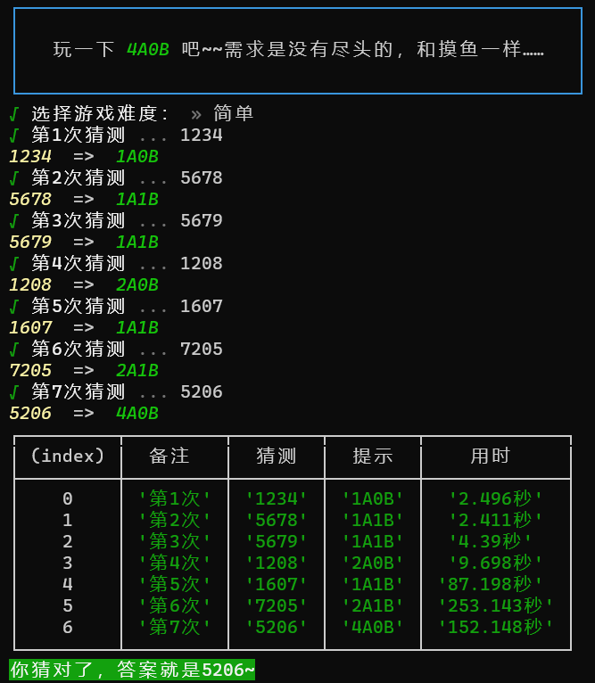

# fourA
一个在命令行中运行的猜数字游戏，不难。

## 安装
```shell
npm i foura -g
```

## 开始游戏
```shell
aaaa

# or
AAAA

# or
foura

# or
fourA
```

## 游戏规则
1. 游戏开始时，生成一个答案，答案是一个长度为4的字符串，其中每个字符是0~9的数字，四个字符不会重复，允许以0开头。
2. 玩家要一直输入同样格式的字符串，直至与答案完全一致即可胜出，但玩家猜测的次数有限（不同模式也可能不同），次数用完未猜出正确答案即游戏失败。
3. 玩家每次输入猜测的数字后，代码会比对“猜测”与“答案”之间的差别给出形如“xAyB”格式的字符串作为提示，其中x和y是一个大于等于0小于等于4的数字。
4. 如果“猜测”中有一个数字在“答案”中数字相同并且位置相同，那么x=1，例如：答案1234，猜测1567，提示1A0B；
   如果“猜测”中有两个数字在“答案”中数字相同并且位置相同，那么x=2，例如：答案1234，猜测7834，提示2A0B；
   因此，提示中的字母A表示“数字相同，位置相同”这个条件。
5. 如果“猜测”中有一个数字在“答案”中数字相同但是位置不相同，那么y=1，例如：答案1234，猜测5167，提示0A1B；
   如果“猜测”中有两个数字在“答案”中数字相同但是位置不相同，那么y=2，例如：答案1234，猜测3478，提示0A2B；
   因此，提示中的字母B表示“数字相同，但是位置不相同”这个条件。
### 给出以下例子，帮助大家更好理解规则
答案 3654  
第一次猜测：1234 提示：1A1B  
第二次猜测：5678 提示：1A1B  
第三次猜测：5690 提示：1A1B  
第四次猜测：5634 提示：2A2B  
第五次猜测：3654 提示：4A0B（胜利）

## 模式
游戏目前有简单和普通两种模式，简单模式限制8次猜测机会，普通模式限制10次猜测机会，普通模式与简单模式不同之处在于，普通模式在给出第五次提示后，答案中随机一个数字会变化，玩家需要猜出变化之后的四个数字，如果玩家能在前面五次猜测把变化前的答案猜出来，那么也可以胜出。

## TODO
想写一个困难模式，主要是隐藏前面输出的提示，玩家只能看见最近一次输出的提示，但是我太菜了，不知道怎么隐藏前面的输出，如果哪位大佬知道怎么做，欢迎贡献代码。

## 游戏截图
